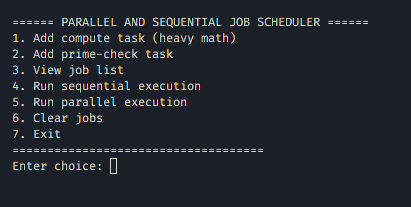

# Job Scheduler (Python)

This project implements a simple job scheduling system that demonstrates the difference between sequential and parallel execution using Python threads. It allows users to add tasks, execute them sequentially or in parallel, and measure performance improvements such as speedup and efficiency.

## Screenshot — Menu

Below is a screenshot of the interactive menu used by the scheduler.

## Features

- Interactive command-line menu
- Supports two task types:
  - Prime number checking
  - Heavy mathematical computation (sum of squares)
- Sequential execution mode
- Parallel execution mode using ThreadPoolExecutor
- Automatic measurement of:
  - Sequential time
  - Parallel time
  - Speedup
  - Efficiency
- Ability to clear jobs or exit

## Requirements

- Python 3.8 or higher

No external libraries are required beyond the Python standard library.

## How to Run

1. Save the script as `scheduler.py`
2. Open a terminal in the same directory
3. Run:

## Usage Instructions

The main menu provides the following options:

1. Add compute task  
   - Adds a heavy mathematical computation job
2. Add prime-check task  
   - Adds a job to test if a number is prime
3. View job list  
   - Displays all queued jobs
4. Run sequential execution  
   - Jobs run one after another on a single worker
5. Run parallel execution  
   - Jobs run concurrently using multiple worker threads
6. Clear jobs  
   - Removes all queued jobs
7. Exit  
   - Closes the program

## Performance Metrics Explained

After running in parallel mode, the program also runs the same jobs sequentially to compute:

- Speedup  
  `speedup = sequential_time / parallel_time`

- Efficiency  
  `efficiency = speedup / number_of_workers`

These metrics help analyze the advantage of parallel execution.

## Educational Objectives

This program is suitable for:

- Parallel and distributed systems courses
- Operating systems and scheduling demonstrations
- Learning Python concurrency concepts
- Benchmarking small CPU-bound tasks

It illustrates core concepts including:

- Job queues
- Worker threads
- Task scheduling
- Parallel vs sequential execution
- Performance measurement

## Limitations

- Uses threads, not processes
- CPU-bound tasks may be affected by the Global Interpreter Lock (GIL)
- Designed for teaching and demonstration, not production workloads

## License

Free for educational and personal use.
